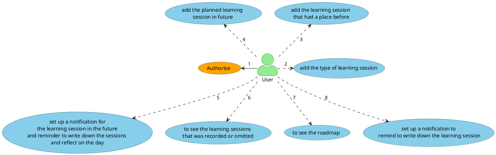

# Specifications
## Content
1. [What is it for](#what-is-it-for)
   1. [The main goal of the project](#the-main-goal-and-tasks-of-the-project)
   2. [Priorities](#priorities)
2. [Glossary](#glossary)
3. [General Use Cases](#general-use-cases)
4. [Business Requirements](#business-requirements)
5. Technical Requirements
6. Nice to have or the glance to the future
 
## What is it for

The project is intended to help me organize my endeavours in learning english.

### The main goal and tasks of the project

The main goal is to help me visualise my efforts. It should motivate me to keep on learning and provide self-confidence.

The tasks:
1. Visualise the learning sessions that I had.
2. Visualise some kind of road map.
3. Notifying to reflect on the day.
4. Simplify reflection process.
5. Access from anywhere (mobile internet).
6. The project should provide MVP in a month.
7. Authorization (perhaps without ability to new registration): since the application should be accessible from
    anywhere, everyone have ability to fill forms and so on. So I must protect the application.

Subtask:
1. the project is intended not only fulfill my needs in a motivation mechanism, but also enhance my skills in such  
   technologies as Go programming language and overall web development process with new language.

### Priorities
1. Quick development - the project must not become a next unfinished pet project. It mean we must pay attention 
   to priorities and keep going with YAGNI principal
2. The UX over UI. The first thing we should think about how to motivate to use the app. The UI also play a role, but
   we should not spend time on it more than it needed - YAGNI. Contrary to UI I should think about UX more carefully. 

## Glossary

| a term           | description                                                                                                                                 | additional info |
|:-----------------|:--------------------------------------------------------------------------------------------------------------------------------------------|-----------------|
| project          | sm-achievements project                                                                                                                     |                 |
| learning session | representing some activity within particular time frame. E.g. The english lesson with the teacher or the reading of the book in evening |                 |

## General Use Cases

## Business Requirements

###  Authorisation

1. There is no reason to create several users. Only I will use the app. (At least for MVP)
2. The pwd should not be stored in the not encrypted format. 
3. Since there is only one user and no registration functional, it is no matter where we store the user entity.
4. There should be login page
5. after login the auth token should be stored either in header with JWT token or in cookies

### add the type of learning session

1. the type of learning session it is the type of the activity. For example the reading the book in English is one type,
   the watching videos is the other.
2. the type contains only one field - "name" , that we can choose in some option list while adding learning session.
 
### the finished or omitted learning sessions
1. learning session has the following fields here to fill:
   1. type of learning session
   2. started at
   3. duration 
   4. grade (quality of the session). If I was distracted again and again during the session, the session had poor quality and low grade.
   5. is_omitted (if the session was planned before, but not finished, it is omitted session)
2. We want to have predefined list of the grades: poor, normal, good, great.
3. We can edit and delete the learning session that was added not more than two days ago.
4. While editing, we can change all the fields listed above.
5. planned learning session become omitted automatically, when the time come. After that we have two days to change the flag on finished;

### the planned learning session 
1. the planned learning session must have the following fields here to fill:
   1. type
   2. when
   3. expected duration
2. the field "when" consists of two steps: 
   1. chose either "once" or "repeat" option. 
   2. chose the date and time (optional, see details below)
3. The option once mean that the only one session will be planned. 
4. The option "repeat" means that we have to point out how often the session will be scheduled.
5. The how the second step looks like depends on the chosen option on the first step:
   1. If there is once, the second step contains only date and time fields.
   2. If there is repeat option there are fields:
      1. day of the week
      2. datetime field "repeat since"
      3. datetime field "repeat until"
      4. time
6. The field time in planned sessions is always optional. It means that we just hope that activity will be performed this day no matter when.
7. we can edit or delete planned learning sessions before they was finished
8. planned learning sessions become omitted automatically 

### notifications 
1. Two kind of notifications (aka reminder):
   1. that the learning session is soon to be.
   2. that we must to write down all learning session that we had today and reflect upon the day.
2. While setting up the first kind of reminder, we can choose relative time in minutes. E.g. 10 minutes before the session.
3. the first kind of reminder can be set up only for some type of session or for concrete learning session.
4. There can be several reminders on one learning session.
5. While setting up the second kind of reminder, we can choose the certain time and day of week.
6. There is no need to set up several reminders of the second kind.
7. We can see the reminders in the list or in the road map. Delete them. We can omit the editing of reminder because 
   we can delete the old reminder and create new one.

### history of learning session
1. there three kind of learning sessions in the history - finished, omitted
2. finished is the one that have taken a place.
3. omitted is the one that have not taken a place.

## Nice to have
1. Goals (two sessions per week, 7 sessions in 20 days)
